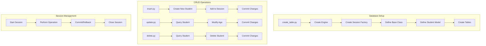

```mermaid
graph TD
    subgraph Database Setup
        A[create_table.py] --> B[Create Engine]
        B --> C[Create Session Factory]
        C --> D[Define Base Class]
        D --> E[Define Student Model]
        E --> F[Create Tables]
    end

    subgraph CRUD Operations
        G[insert.py] --> H[Create New Student]
        H --> I[Add to Session]
        I --> J[Commit Changes]

        K[update.py] --> L[Query Student]
        L --> M[Modify Age]
        M --> N[Commit Changes]

        O[delete.py] --> P[Query Student]
        P --> Q[Delete Student]
        Q --> R[Commit Changes]
    end

    subgraph Session Management
        S[Start Session] --> T[Perform Operation]
        T --> U[Commit/Rollback]
        U --> V[Close Session]
    end
```

